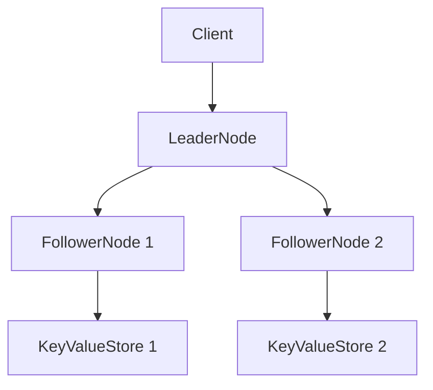

Simple Replicated InMemory key-value store in c# that demonstrates fundamental distributed system concepts focussing on leader - follower replication.

## Features
- Simple key-value store
- Basic operations: (Put, Get and Delete)
- Leader-Follower replication model where there is single leader and multiple followers.
- Read your writes consistency
- Basic Fault Tolerance
- Simple Replication Monitoring and replication happens in sync manner rather than async.

